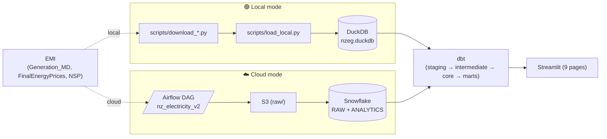

# NZ Electricity Wholesale Market — V2 Pipeline

**ELT pipeline** ingesting NZ electricity **generation, wholesale prices, and network supply points** from EMI, modelling them into a Kimball-style star schema, and serving an interactive Streamlit dashboard. Built to run in two modes from the same dbt codebase:

| | 🟢 **Local** | ☁️ **Cloud** |
|---|---|---|
| Warehouse | DuckDB (local file) | Snowflake |
| Orchestrator | Makefile | Airflow (Docker) |
| Object store | `data/raw/` | AWS S3 |
| dbt profile | `dev` | `prod` |
| Use case | Demo / development / interview | Production-like run |
| Setup time | ~60s (`make demo`) | ~30 min (Snowflake trial + terraform) |

| | |
|---|---|
| **Stack** | Airflow · dbt (Snowflake + DuckDB adapters) · Terraform · Streamlit · uv |
| **Data sources** | EMI Generation_MD · Final Energy Prices · NSP Table |
| **Pipeline** | V1 DAG (generation, 7 tasks) + V2 DAG (3 ingest branches + dbt) |
| **Models** | 23 dbt models (4 cross-db macros) — 21 deploy in DuckDB |
| **Dashboard** | 9 pages: 5 generation (V1) + 4 wholesale-price (V2) |

---

## Quick-start (local demo, no cloud account)

```bash
git clone <repo> && cd nz-electricity-generation-batch-pipeline
uv sync                                     # installs dbt-core + duckdb + streamlit
cp dbt/profiles.yml.example dbt/profiles.yml  # defaults to local DuckDB
make demo                                   # ~60s: download 1 month → DuckDB → dbt run → Streamlit
```

`make demo` opens Streamlit at <http://localhost:8501>. To stop, Ctrl-C.

Other Makefile targets (see `Makefile`):

```
make local-full     # full history (2016-→now) → DuckDB → dbt run + test → Streamlit
make local-subset   # last 12 months only (faster than full)
make dbt-test       # dbt test against DuckDB
make cloud-up       # docker-compose up Airflow (needs .env + SF creds)
make cloud-backfill # trigger Airflow backfill for full history
make cloud-dbt-full # one-shot dbt seed+run+test on Snowflake prod
make cloud-dashboard  # Streamlit against Snowflake
```

---

## Architecture



The dbt project compiles cleanly on both `dbt-duckdb` and `dbt-snowflake`. Cross-database SQL is encapsulated in macros under `dbt/macros/cross_db/` (`unpivot_trading_periods`, `generate_date_spine`, `day_of_week`, `yyyymm_minus_one_month`). See PRD §3 for the dual-run design.

---

## Business questions

**Generation (V1)**
1. Daily/monthly NZ generation by fuel type — `mart_generation_daily`, `mart_generation_monthly`
2. Plant ranking by output — `mart_plant_ranking`
3. Renewable-share trend over time — `mart_renewable_ratio`
4. Seasonal patterns (NIWA southern-hemisphere seasons) — `mart_seasonal_pattern`

**Wholesale Price (V2)**
5. Per-POC daily wholesale price summary — `mart_price_daily`
6. Spike events (>$300/MWh) with co-located fuel mix — `mart_price_spike_events`
7. Renewable share vs price (non-monotonic relationship) — `mart_renewable_price_impact`
8. NI vs SI island spread + HVDC link signal — derived from `mart_price_daily`

---

## Repository structure

```
.
├── airflow/dags/
│   ├── nz_electricity_monthly.py        # V1 — generation only (kept as fallback)
│   └── nz_electricity_v2.py             # V2 — generation || price + NSP + dbt
├── dbt/
│   ├── macros/cross_db/                 # 4 cross-database macros
│   ├── models/staging/                  # stg_generation/price/nsp + audits
│   ├── models/intermediate/             # int_price_daily, int_generation_by_poc
│   ├── models/core/                     # dim_*, fct_*, mart_*
│   ├── seeds/                           # fuel_codes, nz_public_holidays
│   └── tests/                           # singular reconciliation tests
├── scripts/
│   ├── download_generation.py / download_price.py / download_nsp.py
│   ├── load_local.py                    # DuckDB transactional CSV → table
│   ├── load_snowflake_price.py          # SF COPY INTO helper for V2 DAG
│   └── mini_poc_fixture.py              # Phase 0.0 cross-warehouse diff
├── streamlit/
│   ├── app.py                           # navigation
│   ├── loader.py                        # dual-mode connector
│   ├── charts.py                        # shared plot helpers
│   └── pages/                           # 9 pages
├── terraform/                           # SF database / schemas / roles, S3 bucket
├── docs/runbook.md                      # ops playbook
└── docs/plans/PRD_*                     # the spec
```

---

## Cloud-mode setup

See PRD §16 (Implementer Bootstrap) for the day-1 onboarding flow:

1. Snowflake trial account (ap-southeast-2 region).
2. `cp .env.example .env` and fill `SNOWFLAKE_*`, `AWS_*`, `S3_BUCKET_NAME`.
3. `cd terraform && terraform apply` — creates DB / schemas / warehouses / RBAC / S3 bucket / IAM user.
4. `cp dbt/profiles.yml.example dbt/profiles.yml`; the `prod` target reads env vars.
5. `make cloud-up && make cloud-backfill`.

**Host-vs-Docker key-path quirk:** `.env` ships `SNOWFLAKE_PRIVATE_KEY_PATH=/opt/airflow/secrets/snowflake_rsa_key.p8` (the Airflow container path). For host-side dbt or Python runs, override:

```bash
SNOWFLAKE_PRIVATE_KEY_PATH=~/.ssh/snowflake_rsa_key.p8 uv run dbt debug --target prod
```

Don't edit `.env` — Airflow inside Docker still needs the container path.

---

## Phase implementation history

The migration from V1 (generation only) to V2 (price + NSP + cross-source marts) shipped in 4 incremental phases. Each phase commit message details deliverables and PRD deviations:

- **Phase 0** (`94917f8`) — dual-run infrastructure, cross-db macros, Mini POC validates SF ↔ DuckDB equality.
- **Phase 1** (`e8eb44a`) — Final Energy Prices ingestion. PRD §2.3 schema (7 cols) corrected to actual 4 cols.
- **Phase 2** (`836b3c3`) — NSP + dim_node + 4 cross-source marts. NSP coords confirmed NZTM (not lat/lng).
- **Phase 3** (`9ceeff6`) — Dashboard upgrade: dual-mode loader + 4 V2 pages.
- **Phase 4** (this) — V2 DAG, Terraform tables, dual-target CI, README + runbook.

See `docs/plans/PRD_*` "变更记录" table rows 5.1-impl through 5.4-impl for the implementation log alongside the spec.

---

## Observability & SLOs

Pipeline observability is exposed via the **🩺 Pipeline Health** Streamlit page (`pages/pipeline_health.py`), backed by `fct_dbt_run` (Phase 5 Tier 1) and `mart_warehouse_cost` (Tier 2, SF only).

| SLO | Target | Source signal |
|---|---|---|
| Data freshness | Latest successful `model` run ≤ **7 days** old | `fct_dbt_run` (last `is_success`) |
| 30-day model success rate | ≥ **95 %** | `fct_dbt_run` rolling 30 days |
| 30-day test pass rate | ≥ **99 %** | `fct_dbt_run.status='pass'` ratio over 30 days |
| Cost (SF only) | informational — track `usd_estimated` 30-day total | `mart_warehouse_cost` (ACCOUNT_USAGE) |

Each `dbt run` / `dbt test` writes `target/run_results.json`; `scripts/ingest_dbt_artifacts.py` flattens that into `raw.raw_dbt_run`. The v2 DAG runs the ingester via a `TriggerRule.ALL_DONE` task so failed runs are captured too. Local-mode Makefile picks it up the same way.

Slack alerting (optional): set `SLACK_WEBHOOK_URL` env var — the v2 DAG's `on_failure_callback` posts a structured message per failed task. Without the env var, falls back to Airflow's `email_on_failure`.

Tier 2/3 items (anomaly detection, OpenTelemetry, proper SLO burn rate) are spec-only — see PRD §13.4 + §11.

---

## Testing

```bash
make dbt-test                     # 112 dbt tests on DuckDB
pytest tests/ -v                  # DAG integrity (V1 + V2)
uv run python scripts/mini_poc_fixture.py  # SF ↔ DuckDB equality (needs SF creds)
```

CI (`.github/workflows/ci.yml`) runs Ruff, sqlfluff, dbt parse on both `dev` (DuckDB) and `prod` (SF dummy), and DAG integrity tests on every PR. The `dbt parse --target ci` job only runs on `main` push.

---

## License & data attribution

Data: [NZ Electricity Authority — EMI](https://www.emi.ea.govt.nz/). Code: see `LICENSE`.
