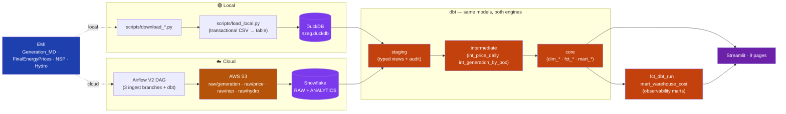
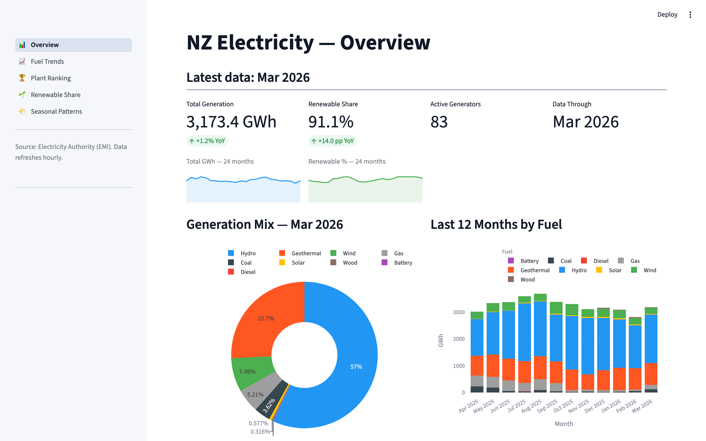
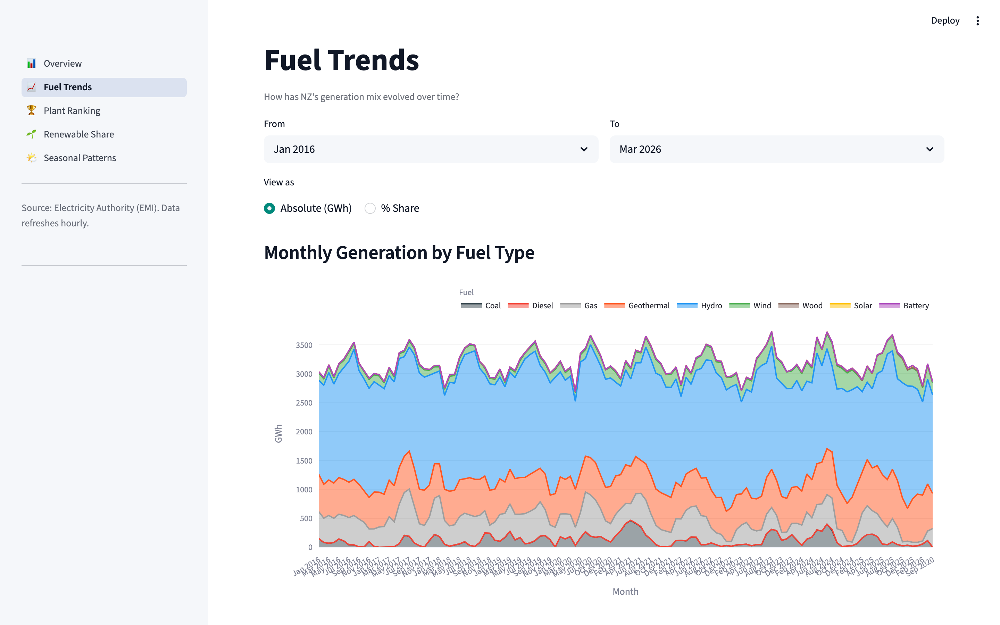
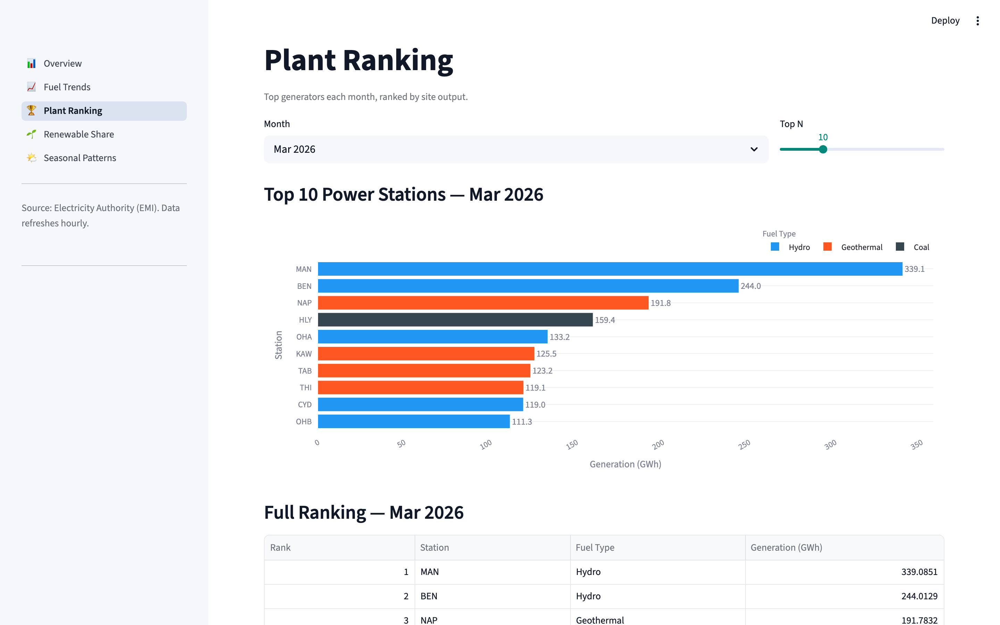
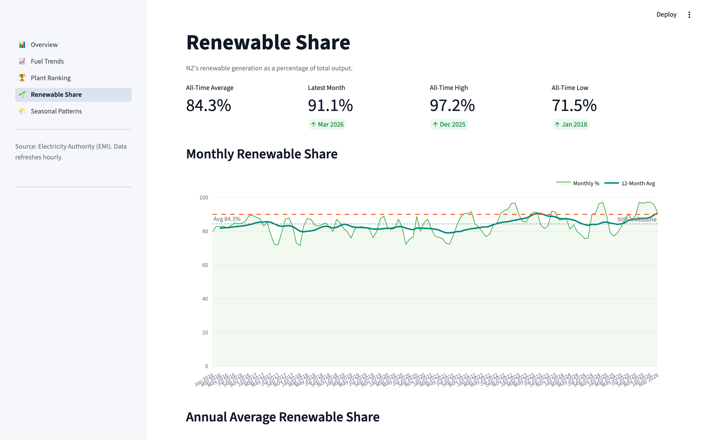
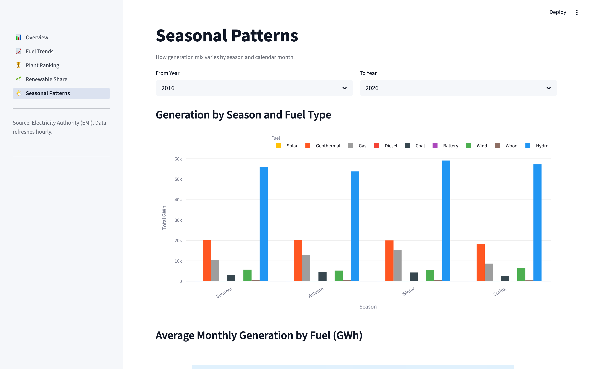

# NZ Electricity Wholesale Market — Cross-Warehouse ELT


An **ELT pipeline that runs the same dbt codebase on Snowflake (production) and DuckDB (local)**, ingesting NZ wholesale electricity data from the Electricity Authority's EMI portal — generation by plant, half-hourly clearing prices by node, and the network supply point (NSP) registry — and serving 9 Streamlit dashboard pages on top of a Kimball star schema.

**Why dual-warehouse?** NZ EMI is open data, but Snowflake costs real money during development and interviews need to run on a laptop. The pipeline is engineered so the *same SQL* compiles cleanly on both engines — local DuckDB for free, full-history demo runs, Snowflake for production-scale runs and ACCOUNT_USAGE-based cost telemetry. That portability is the project's central engineering bet, and the [cross-DB macros](#technical-highlights) are where it's earned.

---

## At a glance

| | 🟢 **Local mode** | ☁️ **Cloud mode** |
|---|---|---|
| Warehouse | DuckDB (single file) | Snowflake |
| Orchestrator | Makefile | Airflow 2.9 (Docker) |
| Object store | `data/raw/` | AWS S3 |
| dbt profile | `dev` | `prod` |
| Setup time | ~90 s (`make demo`) | ~30 min (SF trial + `terraform apply`) |
| Use case | Demo / development / interview | Production-style run with telemetry |

| | |
|---|---|
| **Stack** | dbt 1.8 (Snowflake + DuckDB adapters) · Airflow · Terraform · Streamlit · AWS S3 · uv |
| **Sources** | EMI Generation_MD · Final Energy Prices · NSP Table · Hydro Storage |
| **Models** | 23 dbt models · 4 cross-DB macros · 7 singular reconciliation tests · ~105 schema tests |
| **Dashboard** | 9 Streamlit pages (5 generation + 4 wholesale price) |
| **Observability** | `fct_dbt_run` (run results) · `mart_warehouse_cost` (SF ACCOUNT_USAGE) |

---

## Quick start (local, no cloud account)

```bash
git clone <repo> && cd nz-electricity-generation-batch-pipeline
uv sync
cp dbt/profiles.yml.example dbt/profiles.yml
make demo                                   # ~90s: download 1 month → DuckDB → dbt → Streamlit
```

`make demo` opens Streamlit at <http://localhost:8501>. Other targets:

```
make local-full     # full history (2016 → now) → DuckDB → dbt run + test → Streamlit
make local-subset   # last 12 months only
make dbt-test       # 112 dbt tests on DuckDB
make cloud-up       # docker-compose up Airflow (needs .env + SF creds)
make cloud-backfill # trigger Airflow backfill for full history
make cloud-dbt-full # one-shot dbt seed + run + test on Snowflake
make cloud-dashboard  # Streamlit against Snowflake
```

---

## Architecture



The dbt project compiles cleanly on both adapters because every engine-specific construct is encapsulated in `dbt/macros/cross_db/`. The Airflow V2 DAG ingests generation / price / NSP in parallel branches and then runs dbt + tests in one Snowflake task.

### Dashboard preview

| Generation overview | Fuel trend | Plant ranking |
|---|---|---|
|  |  |  |

| Renewable share | Seasonal pattern |
|---|---|
|  |  |

---

## Technical highlights

**1. One dbt codebase, two warehouses — proven by row-level equality test**

Engine-specific SQL is isolated in 4 macros under `dbt/macros/cross_db/`:

| Macro | Why it exists |
|---|---|
| `unpivot_trading_periods` | NZ uses 48 half-hour trading periods per day. DST spring-forward leaves 46, autumn-back has 50. The macro emits `LATERAL FLATTEN` on Snowflake and `UNPIVOT` on DuckDB, both covering TP01–TP50 with `NULL` filtering for missing periods. |
| `generate_date_spine` | `GENERATE_SERIES` on DuckDB vs `SEQ4()` table generator on Snowflake. |
| `day_of_week` | ISO weekday differs between engines' `EXTRACT` defaults. |
| `yyyymm_minus_one_month` | Backfill arithmetic without engine-specific date functions. |

`scripts/mini_poc_fixture.py` materialises a fixture on both engines and asserts row-level equality. CI runs `dbt parse` against both targets on every PR.

**2. Idempotent ingest with engine-appropriate strategies**

| Layer | DuckDB strategy | Snowflake strategy |
|---|---|---|
| `raw_*` load | Transactional CSV → table (`scripts/load_local.py` wraps in a single transaction; rollback on failure) | `COPY INTO` from S3 stage via `load_snowflake_price.py` |
| `int_*` and `mart_*` | dbt `delete+insert` (DuckDB has no MERGE) | dbt `merge` (faster on SF) |

The choice is target-aware in `dbt_project.yml`. `merge` would silently fail on DuckDB; `delete+insert` would scan unnecessarily on Snowflake.

**3. dbt observability marts — run telemetry from artifacts**

After every `dbt run`/`dbt test`, the v2 DAG's `TriggerRule.ALL_DONE` task pipes `target/run_results.json` through `scripts/ingest_dbt_artifacts.py` into `raw.raw_dbt_run`. The dbt model `fct_dbt_run` flattens it into one row per (run, model). On Snowflake only, `mart_warehouse_cost` joins to `ACCOUNT_USAGE.WAREHOUSE_METERING_HISTORY` for USD-estimated cost per warehouse per day.

Both feed the **🩺 Pipeline Health** Streamlit page, which surfaces the SLOs below without leaving the dashboard.

**4. Reconciliation tests live in dbt, not in a separate test runner**

`dbt/tests/` ships 7 singular reconciliation tests that fail the build if drift is detected:

| Test | What it catches |
|---|---|
| `test_row_count_per_month.sql` | Monthly row counts in mart vs raw drift |
| `test_renewable_total_reconciliation.sql` | Hydro + wind + solar in mart ≠ source aggregate |
| `test_fct_price_raw_reconciliation.sql` | Price mart total MWh ≠ raw clearing prices |
| `test_int_generation_by_poc_reconciliation.sql` | int_generation_by_poc loses or doubles records vs staging |
| `test_fct_mart_monthly_reconciliation.sql` | Monthly mart vs daily mart sums must match |
| `test_poc_match_rate.sql` | POC join coverage to NSP registry below threshold |
| `test_unexpected_null_ratio.sql` | Audit-flagged null ratios exceed tolerance |

---

## Business questions

**Generation (V1)**

1. Daily / monthly NZ generation by fuel type — `mart_generation_daily`, `mart_generation_monthly`
2. Plant ranking by output — `mart_plant_ranking`
3. Renewable-share trend over time — `mart_renewable_ratio`
4. Seasonal patterns (NIWA southern-hemisphere seasons) — `mart_seasonal_pattern`

**Wholesale Price (V2)**

5. Per-POC daily price summary — `mart_price_daily`
6. Spike events (> $300/MWh) with co-located fuel mix — `mart_price_spike_events`
7. Renewable share vs price (non-monotonic) — `mart_renewable_price_impact`
8. NI vs SI island spread + HVDC link signal — derived from `mart_price_daily`

**Hydro driver (cross-source)**

9. Lake storage vs price impulse — `mart_hydro_price_driver`

---

## Data model

```
RAW (S3 / DuckDB)
  raw_generation · raw_price · raw_nsp · raw_hydro · raw_dbt_run
        │
        ▼
STAGING (views, type-cast, audited)
  stg_generation · stg_price · stg_nsp · stg_hydro_storage · stg_dbt_run
  + stg_generation_null_audit · stg_price_outlier_audit  (data-quality views)
        │
        ▼
INTERMEDIATE
  int_price_daily · int_generation_by_poc
        │
        ▼
CORE (dim + fct + mart)
  dim_date · dim_fuel · dim_plant · dim_node · dim_catchment
  fct_generation · fct_price · fct_hydro · fct_dbt_run
  mart_generation_daily · mart_generation_monthly · mart_plant_ranking
  mart_renewable_ratio · mart_seasonal_pattern
  mart_price_daily · mart_price_spike_events · mart_renewable_price_impact
  mart_hydro_price_driver · mart_warehouse_cost (SF only)
```

23 dbt models. 21 build on DuckDB (2 SF-only marts depend on `ACCOUNT_USAGE`).

---

## Observability & SLOs

The **🩺 Pipeline Health** Streamlit page (`pages/pipeline_health.py`) is backed by `fct_dbt_run` and `mart_warehouse_cost`:

| SLO | Target | Source signal |
|---|---|---|
| Data freshness | Latest successful `model` run ≤ **7 days** old | `fct_dbt_run` (last `is_success`) |
| 30-day model success rate | ≥ **95 %** | `fct_dbt_run` rolling 30 days |
| 30-day test pass rate | ≥ **99 %** | `fct_dbt_run.status='pass'` ratio |
| Cost (SF only) | informational — `usd_estimated` 30-day total | `mart_warehouse_cost` |

Slack alerting is optional — set `SLACK_WEBHOOK_URL` and the V2 DAG's `on_failure_callback` posts a structured message per failed task. Without it, it falls back to Airflow `email_on_failure`.

---

## Repository structure

```
.
├── airflow/dags/
│   ├── nz_electricity_monthly.py        # V1 — generation only (fallback)
│   └── nz_electricity_v2.py             # V2 — generation || price || NSP + dbt
├── dbt/
│   ├── macros/cross_db/                 # 4 cross-database macros
│   ├── models/staging/ intermediate/ core/
│   ├── seeds/                           # fuel_codes · nz_public_holidays
│   └── tests/                           # 7 singular reconciliation tests
├── scripts/
│   ├── download_generation.py · download_price.py · download_nsp.py · download_hydro.py
│   ├── load_local.py                    # DuckDB transactional CSV → table
│   ├── load_snowflake_price.py          # SF COPY INTO helper for V2 DAG
│   ├── ingest_dbt_artifacts.py          # run_results.json → raw_dbt_run
│   └── mini_poc_fixture.py              # Cross-warehouse equality test
├── streamlit/
│   ├── app.py                           # navigation
│   ├── loader.py                        # dual-mode (DuckDB / Snowflake)
│   ├── charts.py                        # shared plot helpers
│   └── pages/                           # 9 dashboard pages + Pipeline Health
├── terraform/                           # SF database / schemas / roles · S3 bucket · IAM
├── docs/runbook.md                      # failure-mode runbook
└── docs/plans/PRD_*                     # PRD spec
```

---

## Cloud-mode setup

1. Snowflake trial account (ap-southeast-2 region).
2. `cp .env.example .env` and fill `SNOWFLAKE_*`, `AWS_*`, `S3_BUCKET_NAME`.
3. `make terraform-init && make terraform-apply` — loads `.env`, then creates DB, schemas, warehouses, RBAC, S3 bucket, IAM user.
4. `cp dbt/profiles.yml.example dbt/profiles.yml`; the `prod` target reads env vars.
5. `make cloud-up && make cloud-backfill`.

**Host vs Docker key-path quirk**: `.env` ships `SNOWFLAKE_PRIVATE_KEY_PATH=/opt/airflow/secrets/snowflake_rsa_key.p8` (the Airflow container path). For host-side dbt or Python runs, override:

```bash
SNOWFLAKE_PRIVATE_KEY_PATH=~/.ssh/snowflake_rsa_key.p8 uv run dbt debug --target prod
```

Don't edit `.env` — Airflow inside Docker still needs the container path. See `docs/runbook.md` for the full set of dual-mode pitfalls (caught and fixed during phase 0).

---

## Testing

```bash
make dbt-test                              # 112 dbt tests on DuckDB
pytest tests/ -v                           # DAG integrity (V1 + V2)
uv run python scripts/mini_poc_fixture.py  # SF ↔ DuckDB equality (needs SF creds)
```

| Layer | Coverage |
|---|---|
| dbt schema tests | not_null + unique on PKs · accepted_values on enums · range tests on numeric columns |
| dbt singular tests | 7 reconciliation tests (row counts, totals, join coverage — see Highlights §4) |
| Airflow DAG integrity | DAG parses, has exactly N tasks, dependency graph is acyclic — for both V1 and V2 |
| Cross-warehouse equality | `mini_poc_fixture.py` materialises a fixture on both engines and asserts row-by-row equality |

CI (`.github/workflows/ci.yml`) runs Ruff, sqlfluff, `dbt parse --target dev` (DuckDB) and `dbt parse --target prod` (SF dummy credentials, parse-only), plus DAG integrity tests on every PR.

---

## Scope and non-goals

**In scope**
- ELT from EMI public CSV feeds to a Kimball star schema, runnable on Snowflake or DuckDB from the same dbt codebase.
- Idempotent monthly backfill via Airflow with run telemetry feeding back into the warehouse.
- 9 Streamlit dashboard pages backed by mart-layer tables.

**Out of scope**
- Real-time / streaming ingestion — EMI publishes monthly CSV files with a publish-day delay; batch is the right tool.
- Production SLA ownership — this is a portfolio project demonstrating dual-warehouse ELT patterns, not a managed service.
- Forecasting — the pipeline answers descriptive questions; predictive models are deliberately out of scope.

---

## License & data attribution

Data: [NZ Electricity Authority — EMI](https://www.emi.ea.govt.nz/). Code: [MIT](LICENSE).
