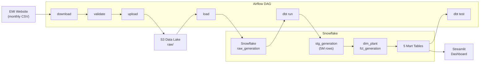

# NZ Electricity Generation — Batch Data Pipeline

**Automated ELT pipeline** that ingests New Zealand's monthly electricity generation data from the [EMI website](https://www.emi.ea.govt.nz/), transforms it through a dimensional model in Snowflake, and serves an interactive dashboard answering four business questions.

| | |
|---|---|
| **Stack** | Airflow · dbt · Snowflake · S3 · Terraform · Streamlit |
| **Data** | 10 years, ~5M rows, 123 monthly CSV files |
| **Pipeline** | 7-task DAG, idempotent, transactional loads |
| **Dashboard** | [Live demo →](#) (5 pages, interactive filters) |

---

## Architecture



### dbt Lineage

```
raw_generation
  └── stg_generation (table — LATERAL FLATTEN, dedup, type cast)
      ├── stg_generation_null_audit (view — TP1-46 NULL monitoring)
      ├── dim_plant (table — Type 1 SCD, composite key)
      └── fct_generation (table — generation_kwh)
          ├── mart_generation_daily (incremental)
          ├── mart_generation_monthly (incremental)
          ├── mart_renewable_ratio (incremental)
          ├── mart_plant_ranking (incremental)
          └── mart_seasonal_pattern (table)
```

### Dashboard

The Streamlit app answers four business questions:

| Page | Question |
|------|----------|
| Fuel Trends | How has NZ's generation mix evolved since 2016? |
| Plant Ranking | Which power stations contribute the most each month? |
| Renewable Share | How has NZ's renewable percentage changed over the decade? |
| Seasonal Analysis | How does the generation mix differ between summer and winter? |

---

## Quick Start

```bash
# 1. Clone and configure
git clone https://github.com/<your-username>/nz-electricity-generation-batch-pipeline.git
cd nz-electricity-generation-batch-pipeline
cp .env.example .env        # fill in AWS + Snowflake credentials

# 2. Provision infrastructure
cd terraform
terraform init && terraform apply
cd ..

# 3. Start Airflow
make build && make up        # Docker Compose: postgres + webserver + scheduler

# 4. Backfill 10 years of data
make backfill                # triggers DAG for each month 2016-01 → 2026-present
make dbt-full                # dbt seed + run --full-refresh + test

# 5. Open
# Airflow UI:  http://localhost:8080  (admin / admin)
# Dashboard:   deployed on Streamlit Community Cloud
```

---

## Project Structure

```
nz-electricity-generation-batch-pipeline/
├── .github/workflows/
│   ├── ci.yml                              # Ruff + SQLFluff + dbt compile + pytest
│   └── dbt-docs.yml                        # Generate & deploy dbt docs to GitHub Pages
├── airflow/dags/
│   └── nz_electricity_monthly.py           # 7-task DAG (download → validate → S3 → Snowflake → dbt)
├── dbt/
│   ├── models/staging/                     # stg_generation, null_audit, sources.yml
│   ├── models/core/                        # dim_plant, fct_generation, 5 marts
│   ├── tests/                              # Reconciliation + NULL anomaly tests
│   └── seeds/fuel_codes.csv                # Fuel code standardisation lookup
├── streamlit/app.py                        # 5-page dashboard
├── terraform/                              # AWS S3 + Snowflake IaC
├── tests/test_dag_integrity.py             # pytest: 7 tasks, dependencies
├── docs/runbook.md                         # Failure diagnosis guide
├── Dockerfile                              # Airflow + dbt (no Spark/Java)
├── docker-compose.yml                      # Postgres + Airflow services
└── Makefile                                # build, up, backfill, dbt-full
```

---

## Technical Deep-Dive

### Why These Choices?

| Decision | Chosen | Why Not the Alternative |
|----------|--------|------------------------|
| No Spark | dbt SQL on Snowflake | ~100 MB total data — Spark adds Java dependency and demonstrates misunderstanding of when distributed processing is needed |
| LATERAL FLATTEN over UNPIVOT | `ARRAY_CONSTRUCT` + `LATERAL FLATTEN` | UNPIVOT silently drops NULLs — DST and data quality NULLs disappear before monitoring can detect them |
| Transactional COPY | `BEGIN; DELETE; COPY INTO; COMMIT;` | Without transaction, failure after DELETE leaves a month's data missing. Explicit ROLLBACK in except handler |
| `EMPTY_FIELD_AS_NULL = TRUE` | File format setting + `NULLIF` | Without this, `CAST('' AS INTEGER)` throws on empty TP columns |
| Composite key `(site_code, gen_code)` | Both in surrogate key | gen_code appears unique but EMI doesn't guarantee it — defensive against collisions |
| stg as table, not view | Materialise once | FLATTEN expands 1 → ~48 rows. As view, 5 marts each re-trigger full expansion |
| kWh at fact, GWh at mart | Precision at fact level | National monthly ~3-4 TWh; GWh is the readable reporting unit |
| mart_renewable_ratio from fct | Flat DAG | Avoids mart-to-mart dependency and cascading failures |
| Season year: Dec → next year | NZ meteorological convention | Dec/Jan/Feb grouped as contiguous season |

### Data Flow Detail

1. **Download**: Airflow `PythonOperator` fetches CSV from EMI. 404 → `AirflowSkipException` (no alert). Exponential backoff on 5xx.
2. **Validate**: Schema check (57 columns), content validation (fuel codes, numeric TPs, date format). Fail-early on unknown fuel codes.
3. **Upload to S3**: Raw CSV stored at `s3://<bucket>/raw/generation_YYYYMM.csv`.
4. **Load to Snowflake**: Transactional `DELETE WHERE trading_month = X` + `COPY INTO` with `METADATA$FILE_LAST_MODIFIED`. Explicit ROLLBACK on failure.
5. **dbt Transform**: `stg_generation` unpivots 46 trading periods via LATERAL FLATTEN, casts types, standardises fuel codes via INNER JOIN to seed, deduplicates with `ROW_NUMBER()`.
6. **dbt Test**: not_null, unique, accepted_values, range checks, NULL anomaly ratio, cross-layer reconciliation (fct ↔ mart totals).

### Pools & Concurrency

| Pool | Slots | Purpose |
|------|-------|---------|
| `emi_download_pool` | 2 | Rate-limit concurrent EMI downloads |
| `dbt_pool` | 1 | Serialise dbt runs — prevent concurrent model builds |

### Performance

| Metric | Value |
|--------|-------|
| Full backfill (123 months ingest) | ~20 min |
| `dbt run --full-refresh` | ~2 min (XS warehouse) |
| Incremental monthly run | ~30 sec |
| Snowflake credits (monthly) | < 0.5 credits |
| S3 storage | ~100 MB total |

---

## CI/CD

GitHub Actions runs on every push and PR:

- **Ruff** — Python linting (`airflow/`, `tests/`, `streamlit/`)
- **SQLFluff** — SQL linting (Snowflake dialect, `dbt/models/`)
- **dbt compile** — Validates SQL without Snowflake connection
- **pytest** — DAG integrity tests (7 tasks, correct names, dependency chain)

---

## Infrastructure

All infrastructure is managed by Terraform:

**AWS**: S3 bucket (versioning, lifecycle → IA after 90 days), IAM user for Snowflake access, budget alert at $5/month.

**Snowflake**: Database, schemas (RAW, ANALYTICS), two warehouses (TRANSFORM_WH for dbt, DASHBOARD_WH for Streamlit), external stage, file format, roles (TRANSFORMER, READER).

```bash
cd terraform
terraform init    # S3 backend with DynamoDB locking
terraform plan
terraform apply
```

---

## Contributing

```bash
# Lint
ruff check airflow/ tests/ streamlit/
sqlfluff lint dbt/models/ --dialect snowflake

# Test
pytest tests/

# dbt (inside Docker)
docker compose exec airflow-scheduler bash -c "cd /opt/dbt && dbt compile"
```

---

## License

MIT
