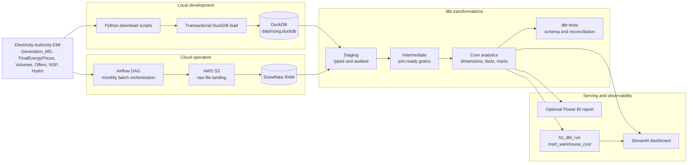

# NZ Electricity Wholesale Market ELT Platform


A production-style batch ELT platform for New Zealand wholesale electricity market data.

The project ingests public Electricity Authority EMI datasets, lands raw files in local storage or AWS S3, loads raw warehouse tables, transforms them with dbt into a Kimball-style analytics layer, runs reconciliation tests, captures dbt run telemetry, and serves the marts through a Streamlit or Power BI dashboard.

The main engineering constraint is portability: the same dbt project runs on DuckDB for local reproduction and Snowflake for cloud operation. That makes the project cheap to review on a laptop while still demonstrating the patterns expected in a cloud data engineering stack.

## What This Demonstrates

This repository is designed to be evaluated as a data engineering project, not only as a dashboard.

| Capability | Implementation |
|---|---|
| Batch ingestion | Python extract and validation scripts for generation, price, reconciled volume, Offers, NSP, and hydro storage datasets |
| Orchestration | Airflow DAG with parallel source branches, retry policy, pools, S3 landing, Snowflake loads, dbt run/test, and artifact ingestion |
| Warehouse modeling | dbt staging, intermediate, dimension, fact, and mart models |
| Cross-warehouse support | DuckDB local target and Snowflake production target using the same dbt codebase |
| Infrastructure as code | Terraform-managed S3 bucket, IAM access, Snowflake database, schemas, stages, file format, and warehouses |
| Data quality | dbt schema tests plus singular reconciliation tests for row counts, totals, join coverage, and null ratios |
| Observability | dbt run results ingested into `fct_dbt_run`; Snowflake warehouse usage surfaced through `mart_warehouse_cost` |
| Analytics serving | Streamlit dashboard backed by mart-layer tables; Power BI can consume the same marts as an optional business reporting layer |

## Architecture



## Data Sources

| Source | Grain | Use in model |
|---|---:|---|
| Generation_MD | Generator x trading date x trading period | Fuel mix, plant ranking, renewable share, generation facts |
| FinalEnergyPrices | POC x trading date x trading period | Price facts, price spikes, island spread, renewable-price analysis |
| Reconciled injection/offtake volumes | POC x participant x trading date x trading period x flow direction | Demand/injection context for price anomaly and spike-feature analysis |
| Daily Offers | POC x participant x unit x trading date x trading period x tranche | Offer-stack and supply-curve context for price spike features |
| Network Supply Points | POC / node reference | Region and island enrichment for price and generation analysis |
| Hydro storage | Site x date | Hydro storage trend and hydro-price driver mart |

The raw datasets include New Zealand half-hour trading periods. The dbt macros handle TP01-TP50 so daylight saving days with 46 or 50 periods can be modeled without hard-coding one warehouse dialect into the project.

## Design Choices

### Dual warehouse target

DuckDB is used for local review, development, and interview demos. Snowflake is used for the cloud path. The same dbt project compiles for both targets, with engine-specific SQL isolated in cross-database macros under `dbt/macros/cross_db/`.

### Raw-to-mart separation

Raw tables preserve source-oriented structures. Staging models handle typing, normalization, and audit flags. Intermediate models create stable grains for joins. Core models expose dimensions, facts, and marts for reporting.

### Idempotent batch loading

Monthly generation and price loads are designed to be rerunnable. The pipeline deletes or replaces the target month before loading corrected files. Snapshot-style reference datasets such as NSP and hydro storage are full-reloaded where that is simpler and safer.

### Tests live with the transformation layer

Data quality checks are part of dbt, not a separate notebook or manual process. The project includes schema tests for primary keys, relationships, accepted values, and ranges, plus singular tests that reconcile mart totals back to raw/staging data.

### Dashboard is a consumer, not the architecture

Streamlit is included because it is easy to run from the repository and demonstrates that the marts are usable. A Power BI report is a good optional portfolio artifact, but it should connect to the same dbt mart layer rather than replacing the engineering demo.

## Repository Layout

```text
.
|-- airflow/dags/                 # Airflow monthly batch DAGs
|-- dbt/
|   |-- macros/cross_db/           # Warehouse-specific SQL abstraction
|   |-- models/staging/            # Typed source-facing models and audit views
|   |-- models/intermediate/       # Join-ready transformation grains
|   |-- models/core/               # Dimensions, facts, analytical marts
|   |-- seeds/                     # Fuel, holiday, and hydro mapping reference data
|   `-- tests/                     # Singular reconciliation tests
|-- scripts/                       # Extract, validation, local load, Snowflake load, artifact ingest
|-- streamlit/                     # Dashboard application and data loaders
|-- terraform/                     # AWS and Snowflake infrastructure
|-- tests/                         # Airflow DAG integrity tests
|-- docs/screenshots/              # Dashboard screenshots
`-- docs/runbook.md                # Operational notes and troubleshooting
```

## Quick Start: Local DuckDB Demo

The local path requires no cloud account.

```bash
uv sync
cp dbt/profiles.yml.example dbt/profiles.yml
make demo
```

`make demo` downloads a small data slice, loads DuckDB, runs dbt, ingests dbt artifacts, and starts Streamlit at:

```text
http://localhost:8501
```

For larger local validation:

```bash
make local-subset    # approximately one year of data
make market-subset   # one month with reconciled volume market analytics
make offer-sample    # adds one latest daily Offers file; this file can be large
make local-full      # full available history
make dbt-test        # dbt tests on DuckDB
```

## Cloud Run: AWS S3, Snowflake, Airflow

Cloud mode requires AWS credentials, a Snowflake account, and a Snowflake key-pair user.

```bash
cp .env.example .env
cp dbt/profiles.yml.example dbt/profiles.yml

make terraform-init
make terraform-plan
make terraform-apply

make cloud-up
make cloud-backfill
make cloud-dbt-full
make cloud-dashboard
```

The cloud path provisions or uses:

| Component | Purpose |
|---|---|
| AWS S3 bucket | Raw CSV landing zone under `raw/` prefixes |
| AWS IAM user/policy | Read access for Snowflake external stage |
| Snowflake database | RAW, STAGING, and ANALYTICS schemas |
| Snowflake warehouses | `TRANSFORM_WH` and `DASHBOARD_WH`, XSMALL with auto-suspend |
| Snowflake stage | `RAW.RAW_STAGE` pointing to the S3 raw prefix |
| Airflow | Monthly ingestion, S3 upload, Snowflake load, dbt run/test, artifact capture |

Host-side dbt and Streamlit commands may need the local private key path instead of the container path:

```bash
SNOWFLAKE_PRIVATE_KEY_PATH=~/.ssh/snowflake_rsa_key.p8 \
  uv run dbt debug --profiles-dir dbt --target prod
```

## dbt Model Layer

```text
RAW
  raw_generation
  raw_price
  raw_market_volume
  raw_offers
  raw_nsp
  raw_hydro_storage
  raw_dbt_run

STAGING
  stg_generation
  stg_price
  stg_market_volume
  stg_energy_offer
  stg_nsp
  stg_hydro_storage
  stg_dbt_run
  stg_generation_null_audit
  stg_price_outlier_audit

INTERMEDIATE
  int_generation_by_poc
  int_price_daily

CORE ANALYTICS
  dim_date
  dim_fuel
  dim_plant
  dim_node
  dim_catchment
  fct_generation
  fct_price
  fct_market_volume
  fct_offer_stack
  fct_hydro
  fct_dbt_run
  mart_generation_daily
  mart_generation_monthly
  mart_plant_ranking
  mart_renewable_ratio
  mart_seasonal_pattern
  mart_price_daily
  mart_price_spike_events
  mart_price_anomaly_events
  mart_price_spike_features
  mart_offer_curve
  mart_price_offer_context
  mart_renewable_price_impact
  mart_hydro_price_driver
  mart_warehouse_cost              # Snowflake only; depends on ACCOUNT_USAGE
```

The analytical marts answer these business questions:

| Area | Questions |
|---|---|
| Generation | Daily and monthly generation by fuel, plant ranking, renewable share, seasonal behavior |
| Wholesale price | Daily POC price, price spikes, negative prices, regional and island spread |
| Market analytics | Reconciled offtake/injection plus offer-curve context for price anomalies and price-spike features |
| Cross-source analysis | Renewable share versus price, hydro storage versus price |
| Operations | dbt model/test success rate, freshness, Snowflake warehouse usage |

## Data Quality and Reconciliation

The project uses dbt tests as deployment gates.

| Test type | Examples |
|---|---|
| Schema tests | `not_null`, `unique`, `relationships`, `accepted_values`, numeric range checks |
| Reconciliation tests | Raw-to-fact price totals, renewable totals, mart daily/monthly consistency, POC match rate, monthly row counts |
| DAG tests | Airflow DAG imports, task counts, dependency graph integrity |
| CI checks | Ruff, SQLFluff, dbt parse for DuckDB and Snowflake-compatible targets, pytest DAG integrity |

Key commands:

```bash
make dbt-test
pytest tests/ -v
uv run python scripts/mini_poc_fixture.py
```

`scripts/mini_poc_fixture.py` is the strongest cross-warehouse check: it materializes a small fixture on DuckDB and Snowflake and compares the output row by row.

## Observability

After dbt runs, `scripts/ingest_dbt_artifacts.py` loads `target/run_results.json` into `raw_dbt_run`. The `fct_dbt_run` model exposes one row per dbt node execution so the dashboard can report:

| Metric | Source |
|---|---|
| Latest successful model run | `fct_dbt_run` |
| Model success rate | `fct_dbt_run` |
| Test pass rate | `fct_dbt_run` |
| Slowest models/tests | `fct_dbt_run.execution_time_seconds` |
| Snowflake warehouse cost estimate | `mart_warehouse_cost` |

Slack alerting is optional through `SLACK_WEBHOOK_URL`. Without it, Airflow still records task failures and logs.

## Dashboard Layer

Run locally:

```bash
NZEG_MODE=local uv run streamlit run streamlit/app.py
```

Run against Snowflake:

```bash
make cloud-dashboard
```

The Streamlit dashboard is intentionally thin: it queries the mart layer and avoids embedding transformation logic in the UI. That keeps dbt as the source of truth and allows another BI tool, such as Power BI, to consume the same tables.

Current dashboard screenshots are stored in `docs/screenshots/`.

## Evidence Pack for Interviews

If you present this project in interviews, prepare screenshots that prove the cloud path actually ran. Redact account identifiers, access keys, private keys, email addresses, bucket names if needed, and any `.env` content.

### AWS evidence

Capture:

1. S3 bucket object listing showing raw prefixes:
   - `raw/generation_md/`
   - `raw/final_energy_prices/`
   - `raw/nsp/`
   - `raw/hydro_storage/`
2. One opened S3 prefix with multiple month files and recent timestamps.
3. S3 bucket properties showing versioning enabled and public access blocked.
4. IAM policy attached to the Snowflake S3 user, with credentials redacted.
5. Terraform plan/apply output showing the S3 and IAM resources were created. Do not share raw Terraform state if it contains secrets.

### Snowflake evidence

Capture Snowsight screenshots with SQL and result grids, not only object browser pages:

```sql
show warehouses like '%WH';

select table_schema, table_name, row_count
from information_schema.tables
where table_schema in ('RAW', 'STAGING', 'ANALYTICS')
order by table_schema, table_name;

select node_type, status, count(*) as executions
from analytics.fct_dbt_run
group by 1, 2
order by 1, 2;

select *
from analytics.mart_warehouse_cost
order by usage_date desc, warehouse_name
limit 20;
```

Also capture:

1. `RAW.RAW_STAGE` definition with the S3 URL partly redacted.
2. `RAW`, `STAGING`, and `ANALYTICS` schemas with raw, staging, fact, dimension, and mart tables.
3. Query history showing `COPY INTO`, `dbt run`, and `dbt test` activity.
4. Warehouse settings for `TRANSFORM_WH` and `DASHBOARD_WH`, especially size and auto-suspend.

### Airflow evidence

Capture:

1. `nz_electricity_v2` DAG graph view showing generation, price, NSP, hydro, dbt, and artifact ingestion tasks.
2. A successful DAG run grid view.
3. Task logs for one S3 upload task, one Snowflake load task, `run_dbt`, `run_dbt_tests`, and `ingest_dbt_artifacts`.
4. Backfill run list if you ran `make cloud-backfill`.

### dbt and CI evidence

Capture:

1. Terminal output for `make dbt-test` or `dbt test --target prod`.
2. dbt docs lineage for at least one mart, for example `mart_renewable_price_impact`.
3. GitHub Actions CI summary showing Ruff, SQLFluff, dbt parse, and DAG integrity tests passing.
4. The `fct_dbt_run` table with recent successful model and test rows.

### Dashboard and BI evidence

Capture:

1. Streamlit overview page connected to DuckDB.
2. Streamlit cloud mode connected to Snowflake, if available.
3. Pipeline Health page showing dbt success/test metrics.
4. Optional Power BI report pages connected to the Snowflake or exported mart layer.

The strongest portfolio evidence is a short sequence: Airflow successful run -> S3 raw files -> Snowflake raw/analytics row counts -> dbt test pass -> dashboard page. That sequence proves the work is an end-to-end data platform, not only a static dashboard.

## Scope

In scope:

- Batch ingestion from public EMI files.
- Local DuckDB and cloud Snowflake execution paths.
- dbt transformation, tests, marts, and run telemetry.
- Airflow orchestration for cloud operation.
- Terraform for AWS and Snowflake infrastructure.
- Streamlit dashboard as a lightweight consumer of the mart layer.

Out of scope:

- Real-time streaming. EMI data is file-based and batch-oriented.
- Production SLA ownership. This is a portfolio-grade implementation, not a managed service.
- Forecasting or machine learning.
- A full BI semantic layer. Power BI is best added as a separate consumer of the existing marts.

## License and Attribution

Data source: New Zealand Electricity Authority EMI public datasets.

Code license: MIT.
